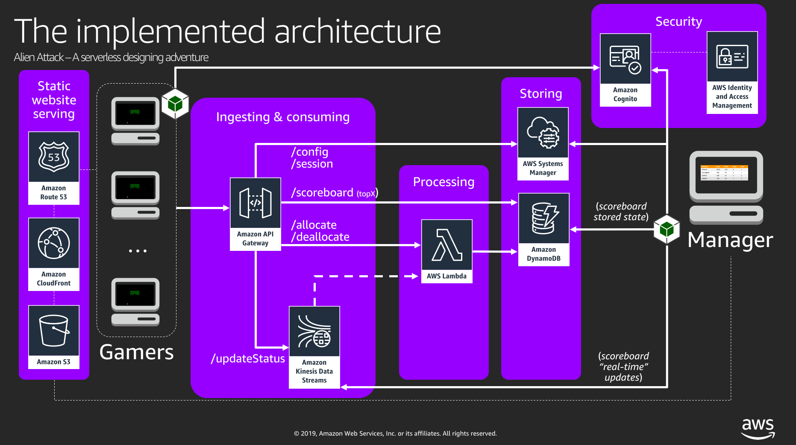

# AWS Alien Attack Workshop

Welcome to the AWS Alien Attack workshop (beta version).   

The purpose of AWS Alien Attack is to create a fun environment where you can test and think about different aspects of serverless architectures for (near) real-time ingesting and processing of data at AWS. You can use Alien Attack to think, exercise, and talk about best practices for development, about security, databases and so on.

<details><summary>
AWS Alien Attack runs very close at zero-cost for one user, but there is cost. Check more details about the services/products used in this list.</summary>

* **CDK**: AWS Alien Attack was built using CDK for the infrastructure deployment. To know more about CDK, check [what is CDK](https://docs.aws.amazon.com/CDK/latest/userguide/what-is.html), and visit its [github repository](https://github.com/awslabs/aws-cdk). Also, take some time to explore this [workshop](https://cdkworkshop.com/).
* **Cloud9**: Cloud9 it will be your "development environment". To know more about Cloud9, including pricing, click [here](https://aws.amazon.com/cloud9/). Cloud9 provides free tier.
* **Amazon Cognito**: Cognito is the service that we are using to provide identification and authentication services to AWS Alien Attack. To know more about Cognito, including pricing, click [here](https://aws.amazon.com/cognito/). Cognito provides free tier.
* **Amazon Identity and Access Management (IAM)**: IAM is a service that allows ytou to create and manage acess to AWS resources, and for Alien Attack we are using roles and polices alongside Cognito to provide the proper authorizations to the users. So, with Cognito and IAM, we cover identification, authentication, and authorization using RBAC (Role-Based Access Control). To learn more about IAM, go [here](https://aws.amazon.com/iam/). IAM is free.
* **Amazon S3**: S3 is used to host the website and to store the raw incoming data for analytics purposes. Read more about it [here](https://aws.amazon.com/s3/). S3 provides free tier.
* **Amazon API Gateway**: API Gateway will be the interface between the gamer and the back-end. To know more about it, go [here](https://aws.amazon.com/api-gateway/). API Gateway provides free tier.
* **AWS Lambda**: Lambda is the foundation for our processing layer. It allows you to run code without having to provision servers. To know more about it go [here](https://aws.amazon.com/lambda/). Lambda provides free tier.
* **Amazon Kinesis Data Stream**: Is the service that we use for ingesting streaming data. To know more about Kinesis Data Stream, including pricing, click [here](https://aws.amazon.com/kinesis/data-streams/). Kinesis Data Streams *has not free tier* , but the cost for this application, for 1 user, the cost associated to Kinesis Data Streams it will be of 1 cent per hour approximately.
* **Amazon Kinesis Data Firehose**: Amazon Kinesis Data Firehose is the easiest way to load streaming data into data stores and analytics tools. It can capture, transform, and load streaming data into Amazon S3, Amazon Redshift, Amazon Elasticsearch Service, and Splunk, enabling near real-time analytics with existing business intelligence tools and dashboards you’re already using today.  We are using it to drop data from Kinesis Data Streams to To know more about Kinesis Data Firehose, including pricing, click [here](https://aws.amazon.com/kinesis/data-firehose/). Kinesis Data Firehose *has not free tier* , but the cost for testing this application will be neglectable. Check the pricing model to learn more.
* **Amazon DynamoDB**: Is the database that we are using to store the scoreboard data for the game sessions. Amazon DynamoDB is s a key-value and document database that delivers single-digit millisecond performance at any scale. It's a fully managed, multiregion, multimaster database with built-in security, backup and restore, and in-memory caching for internet-scale applications. DynamoDB can handle more than 10 trillion requests per day and support peaks of more than 20 million requests per second. DynamoDB provides free tier, and we will be running under it for Alien Attack. To learn more about it, visit [this link](https://aws.amazon.com/dynamodb/).
* **AWS Systems Manager**: Systems Manager provides a unified user interface so you can view operational data from multiple AWS services and allows you to automate operational tasks across your AWS resources. We are using the [Parameter Store](https://aws.amazon.com/systems-manager/features/#Parameter_Store) feature of Systems Manager, which provides a centralized store to manage your configuration data, whether plain-text data such as database strings or secrets such as passwords. To know more about Systems Manager, including pricing, click [here](https://aws.amazon.com/systems-manager/).  Parameter store is free.
* At the *programming* side, we are using [AWS SDK for Javascript in the Browser](https://aws.amazon.com/sdk-for-browser/) and [AWS SDK for node](https://aws.amazon.com/sdk-for-node-js/). Alien Attack was not developed using the best practices, exaclty because one of the workshops is about fixing it and applying the best practices for programming and DevSecOps.
</details>

Considering that we are using Cloud9, these are the regions that, at the time of writing this document, cover all the services required for this workshop. If you are not using Cloud9, other regions can be considered.

~~~
[ { Name: 'Northern Virginia',   Continent: 'Americas', Id: 'us-east-1' },
  { Name: 'Ohio',                Continent: 'Americas', Id: 'us-east-2' },
  { Name: 'Oregon',              Continent: 'Americas', Id: 'us-west-2' },
  { Name: 'Ireland',             Continent: 'EMEA',     Id: 'eu-west-1' },
  { Name: 'Singapore',           Continent: 'APAC',     Id: 'ap-southeast-1' },
  { Name: 'Tokyo',               Continent: 'APAC',     Id: 'ap-northeast-1' } ]
~~~


Have fun!


### Background story

*UnicornGames* is a company focused in designing games for entertainment and in implementing gamefication strategies for companies over different contexts, like sales tracking, investment performance tracking, and more.

We just bought the Alien Attack Unit from UnicornGames. Alien Attack seems to be only a simple game, but under the hood it is a near real-time application (NRTA) that computes scores from an incoming stream of data, and we want to leverage it for other purposes. 

The Chief Development Engineer at the Alien Attack Unit of UnicornGames is not happy by being acquired. He was expecting to become a VP and to buy part of the company. With our acquisition, he mutinied and left the company, taking some of the lead SDEs with him, and leaving us with with a broken code that we need to fix before an upcoming presentation that we are going to do to our executives.

We were able to recover some instructions that we believe will help us to deploy the broken environment, and fix it timely for the C-level demo.

One of the recovered assets is the architecture. Additional information you will find by following the instructions.



We hope that your skills may help us with the challenge of *MAKING THE APPLICATION TO WORK*.


# Instructions

## Preparing the environment

### prepACTIVITY 1 - Cloud9 - Create your environment

#### STEP 1 - Access your account
1. Login to your account.
2. Select a region (take note of the region).

**IMPORTANT:** Be sure that you have permissions to create resources on your account. For the purpose of this workshop, having administrative privileges is the best option.

#### STEP 2 - Launch your Cloud9 environment
1. On the AWS console, go to Cloud9. 
	* Go to the Cloud9 section of the console
	* Select **Create environment**
	* Give a name to your environment. **Important:** If you are sharing the same account and region with a colleague, be sure to take note of the identification of your environment, and be careful to not to destroy your colleague environment.
	* For the "environment settings":
		* For "Environment type" choose `Create a new instance for environment (EC2)`
		* For "Instance type" choose `t2.micro (1 GiB RAM + 1 vCPU)*`
		* Leave the other configuration settings at their default values and click **Next step**, and then **Create environment**

In a few seconds your environment will be available. You can close the Welcome tab, and also the *Immediate* tab that you can see at the bottom of your screen.

#### <a name="config-cloneapprep"></a>STEP 3 - Clone the back-end repository

Down on your Cloud9 console, a terminal is available. Go to the terminal and clone this repository. This repository contains the back-end.

~~~
$ git clone https://github.com/fabianmartins/alienattack.workshop
~~~

#### STEP 4 - Clone the front-end repository

This is the repository for the Alien Attack front-end.

**IMPORTANT:** Disregard any instructions at that repository (but you can always read the comments if you want).

~~~
$ git clone https://github.com/fabianmartins/alienattack.application.git
~~~

At this point, if you look at the left hand side of your Cloud9 console, your folder tree must be showing two main folders: one for `alienattack.workshop` and one for `alienattack.application`.


**IMPORTANT:** The frond-end DOES NOT WORK YET on mobile devices, and in some versions of Windows, especially those with touch screen.


#### STEP 5 - Update the environment - at Cloud9

Getting back to your **Cloud9 environment**, let's update the current instance.

1. Input the command below to get into the alienattack.workshop folder

    ~~~
    cd alienattack.workshop
    ~~~
    Make sure that your screen shows:

    ~~~
    ~/environment/alienattack.workshop
    ~~~

2. Run the following command to update and configure your environment.

    ~~~
    source config.sh
    ~~~

Don't worry if some *warning* messages appear, especially if it's about python.


#### STEP 6 - Start background compilation for CDK

<details><summary>Click here to expand the comments and understand what we are doing here</summary>
There are two ways of building the environment: *continuously*, and *on demand*. 

*On demand* is done by running `npm run build` from inside the cdk folder at each time you change a .ts (typescript) file. This is not very operational, so we will stick to *continuous compilation*.

*Continuous compilation*, the recommended approach, means that the environment will be automatically compiled at every file change, so you can check possible errors right away.

One way of configuring continuous compilation is by having 2 terminals open. One of those terminals you will be using to issue commands. The other one, you will be using to monitor the progress of the development and corresponding compilation.
</details>

1. At the bottom of the page of your Cloud9 IDE, click the **`(+)`** icon, and then `New Terminal` to add a second terminal.
2. Considering that you are at `~/environment` on the new terminal, get into the cdk folder 

    ~~~ 
    cd alienattack.workshop/cdk/
    ~~~
    
    After issuing the command above, your prompt line will look like this:
    
    ~~~
    ~/environment/alienattack.workshop/cdk (master) $
    ~~~

3. Kick off the continuous backgorund compilation by issuing the following command:

    ~~~ 
    npm run watch
    ~~~ 

This will kick off the continuous compilation of the environment. It may take a few seconds until you get the results. 

The output may come out perfectly with 0 errors, or with some errors. If these errors are of the type TS6192 or TS6133, then you're good. These errors appear when some classes are imported but not used, like when part of the code is commented. This will not break the code at the running time.

A totally successful compilation will be something like the output below:

~~~ 
~/environment/alienattack.workshop/cdk (master) $ npm run watch

[0:00:00 AM] Starting compilation in watch mode...


[0:00:00 AM] Found 0 errors. Watching for file changes.
~~~  

**IMPORTANT:** If you decide for not using the continuous compilation, you must remember to run `npm run build` every time you edit and save a file.


#### STEP 7 - Deploy the back-end

You will need to decide for an **"Environment name"** that will be used to configure and deploy your environment. 

**My suggestions for you:**  
 
* **DON'T** use special characters, dashes, spaces in the environment name.
* **DON'T** use long names like *ThisIsAnUnecessaryVeryLongAndName*. Keep it simple. Use something like Env01.
* Also, **DON'T** use very short names, like *fm*. Try to use at least 5 characters to avoid name collisions.
* If you're alone in the account/region, pick a small word for envname, like your initials, and add the month and day just to avoid collisions (ex: fabi0405).
* The environment name will be used to create new S3 buckets. S3 bucket names are global. So, if you use very common words (like test, dev, prod, system, app) almost surely you will get a name collision. Be sure of chosing something that will avoid this kind of issue.
* Avoid using potentially reserved words. Possible reserved words are AWS, S3, and so on.

<details><summary>*Click here to expand and understand why you are doing this step*</summary>
We are running the synthesizing step to give you the opportunity of reading the generated Cloudformation template. Also, the configuration was designed like this for the case when different individuals are sharing the same account (due their company's requirements) and sharing the same region (due the need of specific features of the AWS services, only available in such regions).

Yet, the value chosen for **"envname"** is used to create the buckets required by the application, so chose them in a way that most likely will avoid collision to S3 bucket names (which are global).

For instance, let's suppose that you have selected envname=r2d2. Then, if the deployment is successful, at the end something like this will appear

***

 ✅  R2D2

Stack ARN:
arn:aws:cloudformation:<region>:<account>:stack/R2D2/bc543b91-451f-33f9-442a-02e473ddfb1a

And the deployment will have created the buckets **r2d2.app** and **r2d2.raw**.

if the deployment WAS NOT SUCCESSFUL, then almost surely you had a S3 bucket name collision. if the message is similar to the one below, then chose another envname for your deployment. In the example below, the name TEST for the environment provokes a collision:

~~~
Environment name: TEST
[ { Forbidden: null
      at Request.extractError (/home/ec2-user/environment/alienattack.workshop/cdk/node_modules/aws-sdk/lib/services/s3.js:565:35)
      at Request.callListeners (/home/ec2-user/environment/alienattack.workshop/cdk/node_modules/aws-sdk/lib/sequential_executor.js:106:20)
      at Request.emit (/home/ec2-user/environment/alienattack.workshop/cdk/node_modules/aws-sdk/lib/sequential_executor.js:78:10)
      at Request.emit (/home/ec2-user/environment/alienattack.workshop/cdk/node_modules/aws-sdk/lib/request.js:683:14)
      at Request.transition (/home/ec2-user/environment/alienattack.workshop/cdk/node_modules/aws-sdk/lib/request.js:22:10)
      at AcceptorStateMachine.runTo (/home/ec2-user/environment/alienattack.workshop/cdk/node_modules/aws-sdk/lib/state_machine.js:14:12)
      at /home/ec2-user/environment/alienattack.workshop/cdk/node_modules/aws-sdk/lib/state_machine.js:26:10
      at Request.<anonymous> (/home/ec2-user/environment/alienattack.workshop/cdk/node_modules/aws-sdk/lib/request.js:38:9)
      at Request.<anonymous> (/home/ec2-user/environment/alienattack.workshop/cdk/node_modules/aws-sdk/lib/request.js:685:12)
      at Request.callListeners (/home/ec2-user/environment/alienattack.workshop/cdk/node_modules/aws-sdk/lib/sequential_executor.js:116:18)
    message: null,
    code: 'Forbidden',
    region: 'ap-southeast-1',
    time: 2018-12-21T18:55:32.875Z,
    requestId: '99ECF0537A7B2AD1',
    extendedRequestId:
     'Qxeu5wF9wSXL6xHGMTLsFNq8Fo4b++6A9+Rh1BrG/qYY9k+w/FIU2fhpc+7hPMDiHgG3bohrUDI=',
    cfId: undefined,
    statusCode: 403,
    retryable: false,
    retryDelay: 133.93524816013246 } ]
Unable to find output file /tmp/cdkF6Q2pM/cdk.out; are you calling app.run()?
~~~

</details>

***

#### Step 7.1 - Synthetizing your environment

1. Go to the other available terminal at your Cloud9 environment and be sure of being at the CDK folder. You prompt should look like `~/environment/alienattack.workshop/cdk (master) $`
2. Use the synth command for CDK to synthetize your enviroment.

~~~
cdk synth -c envname=<envname>
~~~

This will generate an output for the corresponding Cloudformation template. You can save it by redirecting the result to some folder, so you can read it through.


#### Step 7.2 - Deploy your backend

Being at your cdk folder, and having decided for an *envname*, run the following command:

~~~
cdk deploy -c envname=<envname>
~~~

CDK will first show you what changes will be applied to the environment. After that, it will ask if you really want to deploy.

Answer with **y**, and wait for environment to be deployed. If everything is ok, at the end you are going to see something like this:

 `✅  <envname>`
 
Below that line, you will see a section named *Outputs*, with some additinal lines. Take note of those. You are going to need it.


## Fix the application

Here is where we start fixing the environment.

The system is comprised of two applications: the Game, and the Scoreboard. We've been said that these applications are needing a facelift. However, let's leave the cosmetics for another opportunity.

We know that the system is not running properly because we tried to run each one of the applications, and while having the browser console opened, we could see a lot of errors, and it's clear that the application is broken.

As you will need to run the application after fixing it (or now, just to check if it's really broken), here is the guidance for opening each one of the applications. 

For this part, you will visit the `alienattack.application` folder in your environment. Let's access both applications:

### Accessing the Game application
1. Select the file **`alienattack.application/game/index.html`**
2. Right-click the file to open the menu, and select **Preview**. A browser will be opened on Cloud9. You are expected to see a screen similar to the one below. 

     
    
3. See that at the right hand side of the line where is the URL for the file we have highlighted a box with an arrow within (we will call it the *window-expanding icon* ) that will open the application on a tab on your browser. This is the best way for us to track what's happening on the application. Click on that box.

If you visit the console of your browser, you will see some 404 errors, and the message `ERROR LOADING CONFIG`. That is expected, as the application is broken.

The process for opening the Manager application is analogous. Follow the steps below:

### Accessing the Manager application
1. Select the file **`alienattack.application/scoreboard/index.html`**
2. Right-click the file to open the menu, and select **Preview**. A browser will be opened on Cloud9. See that at the top. You are expected to see a screen similar to the one below. 

       

3. As we did for the Game Application, click on the *window-expanding box* to open the application in another browser tab.
   
The applications are still not working. We need you to work on the architecture to make it work properly.


### fixACTIVITY 1 - Application - Fix the application configuration

We got a tip from one of the developers that remained at the company that a config file is an important part of the application, and without being properly configured, the application will not run.

##### [Problem] 
The config file for the downloaded application is invalid.

##### [Solution guidance]
On Cloud9, go to the folder where you have cloned the application and open the file `alienattack.application/resources/js/awsconfig.js`. It is going to have the following format:

~~~
const DEBUG = true;
const AWS_CONFIG = {
    "region" : "<region where the env is deployed>",
    "API_ENDPOINT" : "<API Gateway invoke URL>/v1/",
    "APPNAME" : "<name of the application>"
}
~~~

You need to replace the fields with the values related to the environment that you have just deployed using CDK. Follow the steps below to find the required input and to get familiarized with the services' console at AWS:

1. **API_ENDPOINT**
  * From Cloud9, to open another window for the AWS console, just go to the menu and click on *AWS Cloud9* --> *Go To Your Dashboard*, and then *Services* --> *API Gateway*. You will find your API there.
  * Click on the API named as **`<envname>`** (the name that you have chosen for your deployment).
  * Click on **Stages**.
  * Click on **prod**.
  * At the top of the screen, on the right, you will see the **INVOKE URL**. It has the format `https://<API Id>.execute-api.<region>.amazonaws.com/prod`. When copying it to the required field in the awsconfig.js, don't forget to add the */v1/* at the end.


2. **region**: You can extract the region from the API_ENDPOINT, or you can even go to your console and check the URL. It will be like `https://<region>.console.aws.amazon.com`. Write it as is, using lowercase.


3. **APPNAME**: This one is easy. Just copy the value that you have selected for *envName*, **BUT MAKE SURE TO USE UPPERCASE**. So, for instance, if you selected *r2d2* for envName, then the value for this field will be *R2D2*.

If you did everything correclty, your aws_config.js file will be similar to this:

~~~
const DEBUG = true;
const AWS_CONFIG = {
    "region" : "us-east-1",
    "API_ENDPOINT" : " https://x22cd4aa99.execute-api.us-east-1.amazonaws.com/prod/v1/",
    "APPNAME" : "R2D2"
}
~~~ 

**Save the file** (On Cloud9, go to the menu option `File`, and then click on `Save`).

**-- FastFix --**  
Use the results that you have got from the deployment. They will help you to fill the gaps on that file.

**IMPORTANT**  

* In the future, when doing this on your own computer, be sure of saving the file using UTF-8 (pure text). Avoid editors that save the files with special characters
* Don't forget to maintain the quotes that are on those fields. 
  * For example, if you are in us-east-1, the line for the region will be `"region" : "us-east-1"`. See, the quotes are there.
* Be sure of using **uppercase** for the value of the field APPNAME. So, for example, if your environment name is r2d2, the line for appName will become `"APPNAME" : "R2D2"`. 
* Again, check if the quotes are there!
* `Save the file!`


### fixACTIVITY 2 - Test the registration process

Now, the application might be running, at least in part. Let's try to create an user. Confirm that you executed the Fix Activity 1. The file `./resources/js/aws_config.js` must be properly configured.  

1. Go to the Game tab that you have just opened using the process described in the section ["Accessing the Game Application"](#accessing-the-game-application). Reload it (This is important!). If it's not opened, please reopen it.
2. If everything was ok, you are going to see on the console window of your browser that the 404 errors are not there anymore, and that the message `CONFIG LOADED` is shown, meaning that the application was able to retrieve the configurations.  
3. You will see a page with the buttons `Register` and `Login`. Choose **Register**.
4. Register yourself filling the fields properly
	* **Username**: Define a username. Use only lowercase letters and don't use symbols. Don't use your email here also, as this is a PII information.
	* **e-mail**: You will need a valid and accessible email. Cognito needs to send you a confirmation email and you will need to click on it to confirm. We recommend using a personal email to not get into anti-spam controls.
	* **Password**: For testing purposes, use a simple password (like `abc123`). This password is managed by Cognito. So, it's not stored on any application database.
	* **Confirm (and memorize, or take note) your password**: Repeat your password.
	* **Your company's web domain (ex: aws.amazon.com)**: Input your company domain.
	* Click on the button **Register**.
6. If everything went well, you will receive a confirmation on your email. Open the email and click on the link.

### fixACTIVITY 3 - Test the login process

1. Get back to the Game application on your browser, and now choose **Login** (or skip to step 2 if you're already there).
2. Enter your credentials, and click on **Login**.
3. If you entered your credentials right, you will see a pop-up message `Login successful to user <username>`.
4. If you get to a page where the indicating status is WAITING and a countdown stuck at 10, then the login is ok, but something else is wrong (you can check the browser console, if you want).


### fixACTIVITY 4 - Test the Alien Attack manager console

The manager console is where the manager creates a game session, and starts the game so the other participants can join it.

1. Go to the Manager application, that you have opened using the steps described in the section ["Accessing the Manager application](#accessing-the-manager-application). The same way that we did with the Game application, if you already have it opened on a tab, reload it.
2. The page will show some fields for you to enter the username and password that you defined earlier. Do it.
3. If the application indicates `AccessDeniedException`, then we have an access problem. Proceed to the next fixActivity to keep on fixing the system.


### fixACTIVITY 5 - Cognito - Fix the permissions on the groups for RBAC

The people from the Security Team that joined our task force to solve the issues said that is essential to have RBAC (Role-Based Access Control) properly configured on the system. They also said that the version of the CDK used here doesn't allow us to solve that by code, unless we create a Custom Resource as it was done for the creation of the User Pool. Nobody on the team knows how to do it, and we don't have time to dive deep on it now. 

However, one of the SysAdmins said to have the playbook for that, and send us the guidance. Let's try to leverage it.

##### [Problem] 
The Identity Pool configuration is missing the configuration of the roles for each one of the groups (Managers and Players). We need to attach the proper roles to the user when the user signs in to the application.

##### [Solution guidance]

This is the playbook that we've got from

1. On your AWS Console, visit the Cognito service page.
2. If you got to the landing page of the service, you will click on the button **Manage Identity Pools**. 
    * If by any reason you have landed on the User Pools configuration page, look at the top of the window and click on *Federated Identities*.
3. You will see an Identity Pool named as `<envName>`. Click on it.
4. On the top right, there is a very discreet label entitled `Edit Identity Pool`. Click on it.
5. Open the section `Authentication Providers`.
6. Click on the tab `Cognito` just to be sure that you have it selected.
7.  On the section `Authenticated role selection` there is a select button labeled as `Use default role`. Click on this button and select **Choose role with rules**. We will create two rules.
8. First rule - **MANAGERS**
  * For the field `Claim`, input the value **cognito:preferred_role**.
  * For the drop down box at the right side of the field, select the value **Contains**.
  * For the input box at the right of the `Contains` box, input the value **`<envName>ManagersRole`**. Be careful with typos, and use uppercase for the *`<envName>`* part.
  * For the drop down box on the right, select **`<envName>ManagersRole`**.
  * Click on the button `Add another rule`.  
9. Second rule - **PLAYERS**
	* For the field `Claim`, input the value **cognito:preferred_role**.
	* For the drop down box at the right side of the field, leave the value **Contains** selected.
	* For the input box at the right of the `Contains` box, input the value **`<envName>PlayersRole`**. Be careful with typos, and use uppercase for the *`<envName>`* part.
	* For the drop down box on the right, select **`<envName>PlayersRole`**.
10. On the drop down box **Role resolution**: Select **`Deny`**
11. Double check everything for typos, especially the fields *"Claim"* and *"Role"*
11. Leave everything else as it is and click on **`Save changes`**

**-- FastFix --**  
The fast fix for this step requires a series of steps. All of these steps where condensed into the file `fixcognito.sh`

1. On your Clou9 environment, go to the folder `alienattack.workshop` by issuing:

~~~
cd ~/environment/alienattack.workshop
~~~

2. Run the following command:

~~~
source fixcognito.sh <envname>
~~~

### fixACTIVITY 6 - Testing the accesses again

#### Step 1 - Testing again the login to the game
Execute again the ***fixACTIVITY 3***. We've been said that it still will not work. Please confirm that this is the outcome of the test.

#### Step 2 - Testing again the login to the manager console
Execute again the ***fixACTIVITY 4***. We've been said that we are getting an AccessDeniedException. 

Let's proceed to the next activity and check if we can fix the login page.


### fixACTIVITY 7 - Cognito - Configure yourself as a manager

We have found some notes on the desk of the solutions architect. There is a post-it note where is written *"use AWS CLI to make yourself an application admin"*. The following steps were found that note. Hopefully they will help you to solve the issue.

**Task 1.** Take note of the USER POOL ID  

1. Visit your AWS console, and go to Cognito
2. Click on **Manager User Pools**
3. Click on the user pool that has the same name as the one that you defined for your application (`envName`)
4. Take note of the *Pool Id* (or copy it to a helper text file)

**Task 2.** Use AWS CLI to include your username into the Managers group  

1. Go to the terminal of your Cloud9 environment - or on your computer, with AWS CLI credentials properly configured with administrative permissions.
2. Run the command below. The command will add you to the group *Managers*, which will give you access to the Scoreboard Manager resources
3. Get back to the manager console, and try access it again

~~~
$ aws cognito-idp admin-add-user-to-group --user-pool-id <userpoolid> --username <username that you used to register> --group-name Managers --region <region>
~~~

**-- FastFix --**   
There is another way of solving this at the AWS Console. Go to Cognito, visit User Pools, click on `Users and groups`, and check the group Managers. You can add and remove users from there. 


**IMPORTANT**: This is another action that we DON'T WANT to be executed by hand. How to fix this? How to make the deployment of the environment to create an admin user automatically? Think about it. We will need it in another fixing workshop.

After fixing this, try to login to the manager console again (*fixActivity 4*). If you get a **ParameterNotFound: null**, then that means that we are progressing in our journey to rebuild the environment. Proceed to the next activity. It will help us to solve the issue, we hope.


### fixACTIVITY 8 - Systems Manager - Create the missing parameter

One of the Systems Administrators took a look at the environment, and he said that a parameter missing on the back-end. He said that we need to fix Systems Manager. Go to the Systems Manager console, and create the parameter as specified below.

##### [Problem] 
It seems that a *'session'* parameter is missing, and this is making the application to break. 

This parameter holds the game session configuration. Every time when the Manager creates a new session, or closes it, it's updated. The parameter must exist on the back-end. We need to create it.

##### [Solution guidance]
1. On the AWS Console, go to Systems Manager.
2. Scroll down to the section *Shared Resources*, and click on `Parameter Store`. You will see some parameters starting with `/<envName>/`, but there is no parameter `/<envName>/session`. Let's create it.
3. On the top right of the page, click on **Create parameter**
4. On the section *Parameter details*, enter the following values:  
  * Name: `/<envName>/session`
  * Description: `Existing session (opened or closed)`
  * Type: `String`
  * Value:  `null` (insert the word *null* and be sure of the casing, *Null* will not work).
5. Scroll down and click on **Create parameter**

If everything went well, you will get the message *Create parameter request succeeded*. Check if the parameter exists on the list of parameters.

**-- FastFix --**  
If you want to skip this activity: 

1. Go your CDK project (the one that it's at Cloud9), search for *MISSING PARAMETER* on all .ts (typescript) files, and follow the guidances to adjust the code.
2. Save everything and run **`cdk diff -c envname=<envName>`** at the terminal. This will show you what will be changed on your environment
3. If you agree with the changes, run **`cdk deploy -c envname=<envName>`** to deploy the changes

After fixing this, try to login to the manager console again (*fixActivity 4*). You will be forwarded to the configuration page. The access seems to be ok. 

But, **DON'T TRY TO PLAY YET**. 

In accordance to some notes found, there are other pieces to be fixed.


### fixACTIVITY 9 - Kinesis Streams/Lambda Integration - Integrate Lambda to Kinesis

The people from the Monitoring Team said that they have identified a failure in getting the scoreboard computed and stored on DynamoDb. Our SysAdmin is a friend of one of the rebels, and he got this tip from his friend: *"Check if the Lambda Function with the name Scoreboard is integrated to Kinesis. If there is no trigger configured for the lambda function, that's the issue"*.

##### [Problem] 
The game data is ingested to the Kinesis Streams. Then, Lambda (the service) triggers a Lambda function every second, to make it consume the data from the Kinesis Streams. What happens to the consumed records depends on what is coded on the Lambda function.

We need to connect the Lambda function to Kinesis.

##### [Solution guidance]
1. Go to your AWS Console, and visit the Lambda service page.
2. Search for a function named **`<envName>ScoreboardFn`**.  
3. Click on the name of the function. You will be taken to the configuration page of the lambda function.
4. Check if the information sent from the rebel is correct. On the section named *Designer* if you see the message *"Add trigger"*, then the rebel is right. The trigger is missing. Let's create it.
5. On the left, click on 'Add trigger'
6. On the Trigger Configuration, click on the drop down list and type **Kinesis**. A section for you to configure the trigger will show up.
6. Configure the fields:
   * **Kinesis stream**: Select the Kinesis Data Stream attached to your environment. The name must be in the form `<envName>_InputStream`
   * **Consumer**: select *No consumer*
   * **Batch size**: insert the value *700*.
   * **Batch window**: Input *1*.
   * **Starting position**: select *Latest*.
   * Check box **Enable trigger**: leave it marked for now.
   * Click on the button **Add** at the right.
   * If everything went well you will get a message confirming that you have added the trigger. The Designer section will be updated.

**-- FastFix --**  
If you want to skip this activity: 

1. Go your CDK project, search for *MISSING KINESIS INTEGRATION* on all .ts files, and follow the guidances to adjust the code.
2. Save everything and run **`cdk diff -c envname=<envName>`** at the terminal. This will show you what will be changed on your environment
3. If you agree with the changes, run **`cdk deploy -c envname=<envName>`** to deploy the changes


### fixACTIVITY 10 - Kinesis Firehose - Create the missing Kinesis Firehose

The Analytics Team has complained that when the application is running no data is going to their data lake's staging area. They have said that Kinesis Streams drops the data onto a Kinesis Firehose, and then Kinesis Firehose moves the data to a S3 bucket named with the suffix "raw" (you can check if the bucket exists).

They said *"This is pretty simple! It is just to connect the Kinesis Firehose to the Kinesis Streams. If the Kinesis Firehose doesn't exist, create one! Give us access and we can help, or call us if you need"*.

So, follow the tip, and if you need help, call them.

##### [Problem] 
Check if there is a Kinesis Firehose attached to the Kinesis Streams, and point to the S3 bucket. Fix it, or create it properly.

##### [Solution guidance]
1. Go to your AWS Console, and visit the page of Kinesis (don't confuse it with Kinesis Video).
2. On the service page you are expected to see the Kinesis Streams on the left, and on the right hand side a Kinesis Firehose section where there is nothing for your application. Let's create it.
3. Under the section *'Kinesis Firehose Delivery Streams*', or by clicking on *'Data Firehose*' at the left hand side, click on the button **Create Delivery Stream**.
4. On the section *New delivery stream*, configure the fields as follows:
   * **Delivery stream name**: `<envName>Firehose`.
   * **Source**: Select the radio button *'Kinesis stream'*. 
   * Drop-down **Choose Kinesis stream**: select the stream attached to your deployment (the same one we connected to the Lambda function). Its name starts with `<envName>`.
   * Click **Next**.
   * **Record transformation**: Select *'Disabled'*.
   * **Record format conversion**: Select *'Disabled'*.
   * Click **Next**.
   * **Destination**: Click S3, even if it's already selected.
   * **S3 bucket**: Select the bucket attached to your application. The name will have the form `<envName>.raw`.
   * **S3 prefix**: Leave it blank
   * **S3 error prefix**: Leave it blank
   * Click **Next**
   * **Buffer size**: input the value *1*
   * **Buffer interval**: input the value *300*
   * **S3 compression**: Select *GZIP*
   * **S3 encryption**: Select *Disabled*
   * **Error logging**: Select *Enabled*
   * **IAM Role**: Click on the button `Create new or choose`. An IAM configuration page will open.
   		* *IAMRole*: Leave the option *Create a new IAM Role* selected.
   		* *Role Name*: `<envName>_FirehoseRole`
   		* Click on the button **Allow**. You will be taken to the previous page.
   	* Click **Next**.
   	* Check the presented configuration.
   	* Click on **Create delivery stream**.

If everything went well, you will see that the delivery stream was created.

**-- FastFix --**  
If you want to skip this activity: 

1. Go your CDK project, search for *MISSING KINESIS FIREHOSE* on all .ts files, and follow the guidances to adjust the code.
2. Save everything and run **`cdk diff -c envname=<envName>`** at the terminal. This will show you what will be changed on your environment
3. If you agree with the changes, run **`cdk deploy -c envname=<envName>`** to deploy the changes


### fixACTIVITY 11 - Create a session for the game

Get back to the manager console ('scoreboard/index.html'), and follow the steps below to create a gaming session. At this moment it would be interesting to have the Game and Scoreboard windows opened side by side.
 
1. Reload the Scoreboard console, and login again. This is just to guarantee that your token will be refreshed.
2. On the field `Session Name` input **TEST**
3. On the section `Game Type`, select **Multiple trials**
4. Click on the button **Start game**
5. If the page updates with a table containing a header with the words `Nickname`, `Score`, `Shots`, `Level`, `Lives`, then we are good.
6. Get back to the game tab (or open another one). For a better experience, leave the windows opened side by side. This time, if everything went well, you will see a button labeled **JOIN session**. Click on it.

If you are able to play, **you have fixed it!**

Play a little bit. Check the scoreboard. Check the DynamoDB tables. Check the S3 buckets after some time.

### fixACTIVITY 12 - Computing the performance for the Top10 best players

One of the people from the Analytics team said that they had tested an API that allowed them to retrieve the performance of the players. They need this on-line for the top 10 best players. It seems that this is an initial part of their infrastructure to build a fraud-prevention platform.

We have tried, without any success, to find this code. We were able just to retrieve a small excerpt of the code, which we are showing below. We know that is not the full code required to implement the requirements, but this must be helpful.

So, you are going to need to implement the API from scratch, following the requirements below:

1. The resource to be added on API Gateway must have the name `topxstatistics`.
2. The resource will execute a HTTP GET, passing the querystring sessionId, which will hold the session id provided by the consumer of the API.
   * Something likke `<api>/topxstatistics?sessionId=<session id>`
3. The API Gateway request will be integrated to the Lambda Function that you are going to create, that going to compute the player's performance. The excerpt of code that we have is the one below:

~~~
const computeStatisticsForSession = function(sessionId,callback) { 
  // let's start by reading the session data from the database
  // retrieving the record attached to 'sessionId'
  readTopxDataFromDatabase(sessionId, (err,topXSessionData) => {
    if (err) callback(err);
    else {
      if (!topXSessionData.TopX) 
        // Table is empty. No data found.
        callback(null,null);
      else {
        // here we have the record from the TopX table
        let statistics = [];
        let position = 1;
        // Make the computations
        topXSessionData.TopX.forEach( (item) => {
            let itemStatistics = {};
            itemStatistics['Nickname'] = item.Nickname;
            itemStatistics['Position'] = position++;
            if (item.Shots != 0) {
              itemStatistics['Performance'] = item.Score/item.Shots;
            } else {
              if (item.Score != 0) itemStatistics['Performance'] = -1;
              else itemStatistics['Performance'] = 0;
            }
            statistics.push(itemStatistics);
        });
        callback(null,statistics);
      }
    }
  });
};
~~~

The API must be accessible only by the Manager.

**-- FastFix --**  
We heard that something can be learned from this [link](http://partnerfactoryprogram.s3-website-us-east-1.amazonaws.com/labpack/fullmicroservice/fullmicroservice.html). Be sure of double checking your environment. It seems that you might already have the required table created. You might just need to populate it with data.

### fixACTIVITY 13 - Deploying the WebSocket for APIGateway 

We have heard that at some point someone on the management team has complained that for the game it was possible for someone to start earlier, to have some time to train, and then get into the competition. This manager thought this not to be fair with all gamers, and because of that there was a request to include some sort of mechanism to have all of the gamers start at the same time.

We don’t know how much this functionality will be helpful to our application, but we want to understand how to implement it, because we are expecting to need to implement some kind of mechanism for people to interact to each other. We also want to provide a direct communication layer to customers to support them, so we need to understand how to implement this “push notification” mechanism.

We have learned that this is implemeted via “websockets”, and we have the following playbook when checking the home folder of one of the former SAs. Go through it and let us know if you were able to deploy the required feature.

#### **Task 1:** Create WebSocket on APIGateway
1. Navigate to the API Gateway console 
<a href="https://console.aws.amazon.com/apigateway/home" target="_blank">here</a>.
2. Depending on the state of your account you can find a **Create API** or **Get Started** Button. Click on the one that you see and you are going to be take a create API page.
    1. Press the **WebSocket** radio button for **Choose the Protocol**.
    2. For **API name** put, `<envName>WebSocket`
    3. For **Route Selection Expression** enter `$request.body.action` 
       *Note: If you want to learn more about routes and what they do click on the **Learn More** button next to the input box*
    4. For Description enter, **WebSocket for Alien Attack**.
    5. Click **Create API**
3. Navigate to the **Routes** page (possibly you are going to be there already).
4. Follow the instructions below for each Route:

    1. For the **connect** route:
       1. Click on the **$connect** route.
	     2. Make sure **Lambda Function** is pressed for **Integration Type**
	     3. Make sure **Lambda Proxy Integration** is clicked.
	     4. Enter `<envName>WebSocketConnect` for **Lambda Function**
	     5. For Execution Role enter the ARN for the IAM Role `<envName>API` (to see the instructions expand the section below. Also, it is a great opportunity of reviewing the permissions of that Role)
	        <details><summary>Instructions to find the IAM Role</summary>
		              
            1. Navigate to the IAM dashboard <a href="https://console.aws.amazon.com/iam" target="_blank">here</a>.  

            2. Click on the **Roles** sidebard on the left side of the window.
		        
            3. Search through the Roles to find the `<envName>API` Role.
		            
            4. Click on the Role, then copy the **Role ARN**
		            
            5. *Note: You will need this role for the other two roles; it will be beneficial to copy this ARN to a local clipboard*
	        </details>

		  6. Click and select **Use Default Timeout** 
		  7. Press **Save**
		  8. Press **Ok** for any pop-ups
	</details>
	 
	 2. For the **start-game** route:
	     1. Enter `start-game` in, **New Route Key** and click the check box to the right. 
		  2. Make sure **Lambda Function** is pressed for **Integration Type**
		  3. Make sure **Lambda Proxy Integration** is clicked.
		  4. Enter `<envName>WebSocketSynchronizeStart` for **Lambda Function**
		  5. For Execution Role enter the ARN for the IAM Role `<envName>API` (to find it follow the instructions that we have given before)
        6. Click **Default Timeout** 
		  7. Press **Save**
		  8. Press **Ok** for any pop-ups

   3. For the **Disconnect** route:
        1. Click on the $disconnect route.
        2. Make sure Lambda Function is pressed for Integration Type
        3. Make sure Lambda Proxy Integration is clicked.
        4. Enter `<envName>WebSocketDisconnect` for Lambda Function
        5. For Execution Role enter the ARN for the IAM Role `<envName>API` (to find it follow the instructions that we have given before)
	    6. Click **Default Timeout** 
		7. Press **Save**
		8. Press **Ok** for any pop-ups
  5. Once all the routes are deployed press the dropdown menu, **Actions**.
  6. Click **Deploy API**
	    1. For **Deployment Stage** enter, **[New Stage]**
	    2. For **Stage Name** enter, **Production**
	    3. Press **Deploy**
  7. There is now a page that has the **WebSocket URL** and **Connection URL**
  8. Copy the **WebSocket URL**.

#### **Task 2:** Store WebSocket URL in Parameter Store
1. Navigate to the Systems Manager console 
<a href="https://console.aws.amazon.com/systems-manager" target="_blank">here</a>.
2. Navigate to **Parameter Store** on the lower left side of the webpage.
3. Press **Create Paramater**
    1. For **Name** enter, `/<envName>/websocket` (appname must be all lowercase).
    2. For Description enter, "URL for the WebSocket for AAA"
    3. For value enter the URL that we copied earlier.
    4. Press **Create Parameter** 

#### **Task 3:** Adjust IAM Role
1. Navigate to the IAM Dashboard <a href="https://console.aws.amazon.com/iam" target="_blank">here</a>.
2. Click **Roles** on the left side of the window.
3. Find `<envName>WebSocketSynchronousStart_Role` click on it.
4. Click **Add inline policy**
5. Press JSON. Copy and paste the JSON below: (Note the placeholder for the WebSocket ARN)
```Javascript
{
    "Version": "2012-10-17",
    "Statement": [
        {
            "Effect": "Allow",
            "Action": [
                "execute-api:Invoke",
                "execute-api:ManageConnections"
            ],
            "Resource": "<Your WebSocketARN>"
        }
    ]
}
```
<details><summary>Instructions Finding WebSocketARN</summary>

1. Navigate to the APIGateway dashboard <a href="https://console.aws.amazon.com/apigateway/home" target="_blank">here</a>.
2. Click on the WebSocket we set up.
3. Click on the `$connect` route. 
4. Copy the **ARN** underneath the **Route Request** up until `$connect` (including the `/*`)

The ARN should take the form: `arn:aws:execute-api:{region}:{account ID}:{API ID}/*`
</details> 

6. Press review Policy
7. For name enter, **Invoke-Api-Policy**
8. Press **Create Policy**

**-- FastFix --**  
The fast fix for this step requires a series of steps. All of these steps where condensed into the file `fixwebsocket.sh` which is inside the folder `~/environment/alienattack.workshop`. Go to that folder, and run the following command:

~~~
source fixwebsocket.sh <envname>
~~~

There should be a line that is outputted by the script which says `Websocket ARN: <Your WebSokcet ARN>` use this ARN to complete Task 3 above.

#### Creating a Synchronous Game
1. Visit `./scoreboard/index.html` in your browser, and log in.
2. Press **Single Trial** and check the box **Synchronized**
3. Press **Start Game**
4. The **Sync Button** should be enabled as of right now. 

Note: as of right now anyone in the session can't play they are waiting for you to press **Sync Game**

5. Open `./game/index.html` in another tab, and log in.
6. Press **Join Session**
7. Navigate back to the **Scoreboard** page.
8. Press **Sync Game**.
9. You should now be able to play the game on `./game/index.html`

### Additional (and optional) task for deploying the front-end on the account

It was said that for a full deployment, we will need to install the application at the S3 bucket with the `<appNames>.app`. We will also need to deploy the CloudFront distribution because the S3 buckets are not public.

For this last part, we got intel from the rebels that, to solve this, two actions are necessary:

1. Copy the content of the front-end to the app bucket.
2. Go to the file `mainLayer.ts` which is on the deployment at Cloud9, search for *MISSING CLOUDFRONT DISTRIBUTION* and uncomment it at that file. The deployment it will take something around 20 minutes. Same time it will be required for the undeployment. But we are not expecting to solve this part today. We at the company believe that it was a big win to have reached to this point. Let's leave other adjustments for another sprints.

## PRICING AND LIMITS

Our executives are inexperienced with costs on AWS, and they would like to understand the rationale behind the costs of this architecture.

We learned that some arrangements were done to make this run under AWS Free Tier as much as possible, but we are not sure how much was left outside the free tier.

We know that for the current implementation:

* The payload is 120 bytes in size, in average.
* A player pushes 1 record at every 1 second.
* A player reads the TOP 10 scoreboard (`GET/scoreboard`) at every 2 seconds.
* The Manager scoreboard reads the Kinesis Data Stream at each 1.5 seconds.
* We are using provisioned capacity mode for DynamoDB.

Build a small team to work on the aspects of cost and limits of this architecture.


### Pricing Activity

So, we want you to estimate the costs for the environment - the cost per user and per interval of time (choose the most appropriate) - for the following scenarios:

1. One (1) gamer.
2. Ten (10) gamers.
3. Fifty (50) gamers.
4. One hundred (100) gamers.
5. One hundred and fifty (150) gamers.
6. Two hundred (200) gamers.

### Limits Activity

We are aware that the code has some issues. We heard that the environment is not prepared to scale the ingestion/consumption layer yet, something that we will need to solve *in another workshop*. 

So, **find the limits for this architecture considering that at this moment we will have only one (1) shard for Kinesis Data Streams**.

Tips:
- What are the limits for Kinesis Streams, for one shard?
- How the integration Lambda-Kinesis is affected if we have more users? Do we need to worry about the "batch size" for the Lambda-Kinesis integration? Or do we just need to fine tune it?
- How do we scale DynamoDB? Do we need to do something about it?


## Cleaning up the environment

### cleanACTIVITY 1 - Cleaning up the resources added by hand

Everything that was created by CloudFormation/CDK is going to be deleted automatically, but the resources that you have created directly on the console were not deleted. 

Some of them will not be delete by CloudFormation if we don't do this step, as they have been changed the configuration of the resources maintained by Cloudformation. 

Let's fix this.

1. Go to Systems Manager, then Parameter Store, and delete the parameter `<envName>/session` and `<envName>/websocket`
2. Go to Kinesis, then Kinesis Firehose, and delete the resource that you created by hand
3. Go to IAM, and search for `<envName>`. Delete any resource configured like that. For sure the only resource will be `<envName>FirehoseRole`
4. Go to the IAM console, find the `<envName>WebSocketSynchronizeStartFn_Role`, and remove the **Invoke-Api-Policy** that you have created.
5. Go to API Gateway, and delete the `<envName>Websocket` API that you have created.
6. Clean up the s3 buckets with the following commands (be sure of inputting `<envName>` in lowercase):
   *  `aws s3 rm s3://<envName>.app —-recursive`
   *  `aws s3 rm s3://<envName>.raw —-recursive`

### cleanACTIVITY 2 - Destroy the deployed environment

Go to the the terminal on your environment and type the following command. Be sure to be at your cdk folder.

```
~/environment/alienattack.workshop/cdk (master) $ cdk destroy -c envname=<envName>
```

If everything went well, you will receive a message like the following one: 

```
✅  <envName>: destroyed
```
If by any reason you don't have access anymore to the Cloud9 environment, or is unable to destroy the environment using CDK, go to CloudFormation on your AWS console, and delete the stack with "Stack Name" corresponding to your `<envName>`. Then move to the next activity.


## Final activity

Delete your Cloud9 environment if you created it just for this workshop.
Celebrate! You deserve it!


